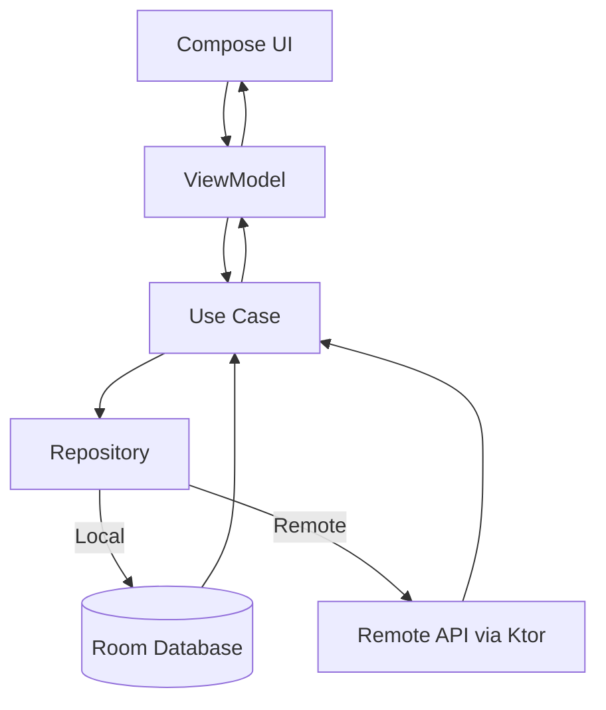

<h1 align="center"> Little Lemon Android Captone 🍋 </h1> 

## 📌 Project Overview
LittleLemon is a mobile application designed for managing and browsing a restaurant’s digital menu.  
It provides users with seamless navigation through dishes, categories, and profiles, while supporting offline storage and remote data sync.  

- **Target Users**: Restaurant customers and admins.  
- **Core Functionality**:  
  - Browse menu items and categories.  
  - User authentication & profile management.  
  - Offline data persistence via Room.  
  - Network calls via Ktor.  

**Tech Stack**:  
- **Language**: Kotlin  
- **UI**: Jetpack Compose  
- **Architecture**: Clean Architecture (MVVM)  
- **Data Layer**: Room Database, SharedPreferences  
- **Networking**: Ktor Client  
- **Dependency Injection**: Hilt (via `AppModule.kt`)  
- **Build Tooling**: Gradle  

---

## 🏗️ App Architecture & Data Flow
The project follows **Clean Architecture + MVVM**, separating concerns into:
- **Presentation Layer** → UI (Compose), ViewModels, Navigation  
- **Domain Layer** → Use Cases, Business Logic, Entities  
- **Data Layer** → Repository, Remote (Ktor), Local (Room), Mappers  

### Data Flow:
1. **User Input** → UI Screen (Compose) → ViewModel  
2. **ViewModel** → Calls UseCase (Domain Layer)  
3. **UseCase** → Repository  
4. **Repository** → Fetches from Remote (Ktor) or Local (Room/SharedPrefs)  
5. **Data Mapped** → Domain → Presentation Model → Displayed in UI  



This content is already largely in Markdown format, but I'll restructure and enhance it using proper Markdown syntax (like code blocks, nested lists, and bolding) to make the file structure, setup instructions, and features clearer and more aesthetically pleasing.


## 📂 File & Folder Structure

The project employs a modular, **Clean Architecture** approach, separating code into distinct layers for maintainability and testability.

```
LittleLemon-main/
├── build.gradle            # Project-level build config
├── settings.gradle         # Module settings
├── gradle.properties
├── .github/workflows/      # Continuous Integration (CI) workflows
└── app/
    ├── build.gradle        # App module Gradle configuration
    ├── src/main/
    │   ├── AndroidManifest.xml
    │   ├── java/com/mdevor/littlelemon/
    │   │   ├── data/               # Data Layer (Sources & Repository Implementation)
    │   │   │   ├── local/          # Room Database & Shared Preferences
    │   │   │   ├── remote/         # Ktor API Services
    │   │   │   ├── repository/     # Concrete Repository Implementation
    │   │   │   └── mapper/         # Data Transfer Object (DTO) ↔ Domain Mapping
    │   │   ├── domain/             # Core Business Logic Layer
    │   │   │   ├── entities/       # Domain Models (Entities)
    │   │   │   ├── usecases/       # Use Cases
    │   │   │   └── repository/     # Repository Interface
    │   │   ├── di/                 # Dependency Injection (Koin Modules)
    │   │   ├── presentation/       # UI Layer (Jetpack Compose)
    │   │   │   ├── screens/        # Feature-specific Composables (Home, Login, Profile)
    │   │   │   ├── navigation/     # Compose Navigation Host & Routes
    │   │   │   ├── components/     # Reusable UI Components
    │   │   │   └── viewmodels/     # ViewModels for UI State Management
    │   │   ├── MainActivity.kt     # Single Activity entry point
    │   │   └── MainApplication.kt  # Application class (Koin setup)
    ├── schemas/                    # Room Database schema JSON files
    └── res/                        # Resources (Drawable, values, fonts)
```

## ⚙️ Setup & Installation

### Prerequisites

  * [Android Studio](https://developer.android.com/studio)
  * **JDK** 17+
  * **Gradle** 8+
  * Stable internet connection for initial API data fetching

### Steps

1.  **Clone the repository:**
    ```bash
    git clone https://github.com/Khilesh-01/little-lemon.git
    cd LittleLemon-main
    ```
2.  **Open in Android Studio:**
      * Navigate to **File \> Open** and select the `LittleLemon-main` folder.
3.  **Sync and Build:**
      * Allow Gradle to sync dependencies and build the project.

### Environment Variables

For secure API configuration, create a file named `local.properties` (or similar, if supported by your setup) in the project root and add your API base URL:

```
API_BASE_URL=https://api.littlelemon.com/
```

## 🚀 Usage Instructions

### Running the Application

  * **Via Gradle:**
    ```bash
    ./gradlew installDebug
    ```
  * **Via Android Studio:**
      * Click the **Run ▶️** button.

### Running Tests

  * **Unit Tests (JVM):**
    ```bash
    ./gradlew test
    ```
  * **Instrumented Tests (Device/Emulator):**
    ```bash
    ./gradlew connectedAndroidTest
    ```

### Debugging

  * Utilize **Logcat** in Android Studio for real-time application logs.
  * Enable **StrictMode** in the application for catching threading and I/O issues during development.

## 🖼️ Screenshots & Visuals

- [Little Lemon Figma](https://www.figma.com/design/cgqWxYBfPoXTutUv45kYGl/Little-Lemon-Assignment?m=auto&t=ePuWL1npWzoZd7ZS-6)

| Register                                                | Desserts                                             | Home                                            |
| ------------------------------------------------------- | ------------------------------------------------- | ----------------------------------------------- |
|  |  |  |

| Menu                                            | Filter                                              | Profile                                               |
| ----------------------------------------------- | --------------------------------------------------- | ----------------------------------------------------- |
|  |  |  |

| App Flow                                        |
| ----------------------------------------------- |
|               |


## ✨ Features & Modules

| Module | Core Functionality | Details |
| :--- | :--- | :--- |
| **Authentication** | Login & Registration | Handles user session persistence via Shared Preferences. |
| **Menu Browsing** | Categories & Listings | Displays the menu with dynamic filtering and search capabilities. |
| **Offline Storage** | **Room Database** | Caching of menu items for an improved **Offline-First** experience. |
| **User Profile** | Details View/Update | Allows users to view and modify their personal information. |
| **UI Components** | Reusable Composables | Modular UI elements (Buttons, TopBars, Text Fields) built with **Jetpack Compose**. |
| **Navigation** | Single Activity Pattern | Uses **Compose Navigation Host** for seamless screen transitions. |

## 🛠️ Libraries & Tools

| Resource | Functionality                           |
| ------ |-----------------------------------------|
| [Figma](https://figma.com) | Design and access resources of the prototype |
| [Coil](https://github.com/coil-kt/coil)| Image loading library                   |
| [Ktor](https://github.com/ktorio/ktor)| Network HTTP client                     |
| [Koin](https://github.com/InsertKoinIO/koin)| Dependency Injection                    |
| [Maestro UI](https://maestro.mobile.dev)| Mobile UI Testing Framework             |
| [Kover](https://github.com/Kotlin/kotlinx-kover)| Kotlin Code Coverage Tool               |

## ⚠️ Limitations & Future Improvements

### Current Limitations

  * No integrated backend authentication service (auth is currently stubbed/simulated).
  * Limited **Maestro UI** test coverage for complex Compose components.
  * Offline-first support can be expanded to cover more application states.

### Future Roadmap

1.  Implement **Multi-language support** (i18n).
2.  Develop an **Admin panel** for dynamic menu updates.
3.  Integrate **Push notifications** for special offers and updates.

## 📜 License & Credits

  * **Credits:**
      * [Meta Android Developer Professional Certificate](https://www.coursera.org/professional-certificates/meta-android-developer?#courses)
      * [Jetpack Compose](https://developer.android.com/jetpack/compose/) (Declarative UI)
      * [Ktor](https://ktor.io/) (Network HTTP Client)
      * [Room](https://developer.android.com/training/data-storage/room) (Persistence Library)
      * [Koin](https://insert-koin.io/docs/quickstart/android/) (Dependency Injection)